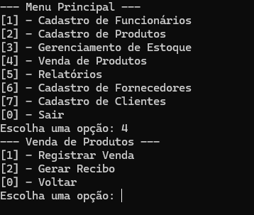

# Sistema de Gestão de Vendas

  

## Descrição

Este é um sistema de gestão de vendas simples desenvolvido em Python. O sistema permite gerenciar cadastros de funcionários, produtos, fornecedores, clientes, bem como gerenciar o estoque e registrar vendas. Além disso, o sistema gera relatórios de vendas e produtos.

## Funcionalidades

### Cadastro de Funcionários

- Adicionar novos funcionários
- Editar informações dos funcionários existentes

### Cadastro de Produtos

- Adicionar novos produtos
- Editar informações dos produtos existentes
- Excluir produtos do sistema

### Gerenciamento de Estoque

- Atualizar a quantidade de produtos no estoque
- Exibir produtos em baixo estoque
- Registrar entrada e saída de produtos

### Venda de Produtos

- Registrar vendas
- Gerar recibo para o cliente
- Atualizar estoque após cada venda

### Relatórios

- Gerar relatórios de vendas diárias, semanais, mensais e anuais
- Relatórios de produtos mais vendidos
- Relatórios de estoque atual

### Cadastro de Fornecedores

- Adicionar novos fornecedores
- Editar informações dos fornecedores existentes
- Excluir fornecedores do sistema

### Cadastro de Clientes

- Adicionar novos clientes
- Editar informações dos clientes existentes
- Excluir clientes do sistema

## Estrutura do Projeto

- `App.py`: Arquivo principal que contém o menu do sistema.
- `Funcoes.py`: Contém todas as funções necessárias para o funcionamento do sistema.
- `funcionarios.json`: Arquivo JSON que armazena os dados dos funcionários.
- `produtos.json`: Arquivo JSON que armazena os dados dos produtos.
- `fornecedores.json`: Arquivo JSON que armazena os dados dos fornecedores.
- `clientes.json`: Arquivo JSON que armazena os dados dos clientes.
- `vendas.json`: Arquivo JSON que armazena os dados das vendas.
- `comprovantes_vendas/`: Pasta que armazena os comprovantes de vendas.

## Menu Principal
O menu principal oferece as seguintes opções:

- Cadastro de Funcionários
- Cadastro de Produtos
- Gerenciamento de Estoque
- Venda de Produtos
- Relatórios
- Cadastro de Fornecedores
- Cadastro de Clientes
- Sair
- Navegação
- Escolha uma opção do menu principal digitando o número - correspondente e pressionando Enter.
- Em cada submenu, escolha a ação desejada.
- Para voltar ao menu anterior, selecione a opção Voltar.
- Exemplos de Uso
- Cadastro de Funcionários
- Selecione Cadastro de Funcionários no menu principal.
- Escolha Cadastrar Funcionário e preencha as informações solicitadas.
- Registrar Venda
- Selecione Venda de Produtos no menu principal.
- Escolha Registrar Venda, informe o nome do produto, a quantidade vendida, e a forma de pagamento.
- Um comprovante da venda será gerado na pasta comprovantes_vendas.

## Contribuição
Contribuições são bem-vindas! Sinta-se à vontade para abrir issues e pull requests.

## Licença
Este projeto está licenciado sob a MIT License.